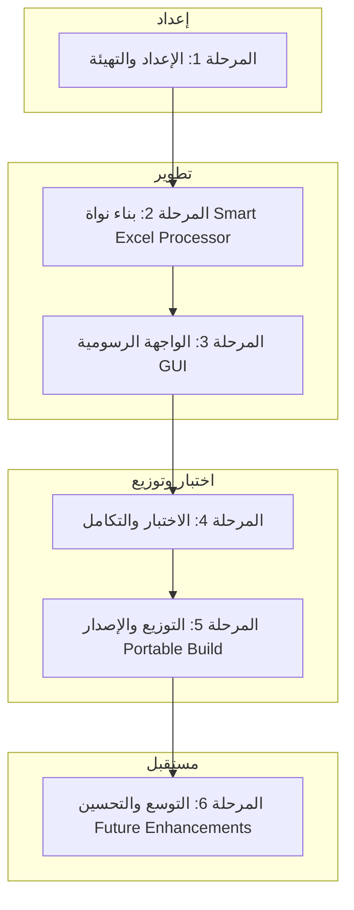

# الخطة التنفيذية التفصيلية لمشروع BGLApp Lite — Smart Excel Processor Edition

---

## 1️⃣ المرحلة الأولى: التثبيت والتهيئة (Setup & Scaffolding)

**المدة التقديرية:** يوم إلى يومين
**الهدف:** إعداد بنية المشروع الجديدة دون التأثير على النظام الحالي.

### 🔹 المهام

1. **إنشاء مجلد المشروع:**

   ```bash
   mkdir BGLApp_Lite/{app/{core,gui,config,templates},launcher,build,dist,data}
   ```

2. **تهيئة البيئة الافتراضية:**

   ```bash
   python -m venv venv
   venv\Scripts\activate
   pip install -r requirements-lite.txt
   ```

3. **إعداد مكتبة المتطلبات (requirements-lite.txt):**

   ```text
   pandas
   openpyxl
   rapidfuzz
   python-dateutil
   fpdf2
   arabic-reshaper
   python-bidi
   ```

4. **إضافة ملفات تعريف (config):**

   * `schema_ref.json`: أسماء الأعمدة المقبولة.
   * `banks_dict.json`: قاموس البنوك.
   * `companies_dict.json`: أسماء الموردين.
   * `default_settings.json`: إعدادات التشغيل الافتراضية.

5. **تحضير قوالب المخرجات (templates):**

   * `letter_template.html`: القالب الرسمي للخطاب.
   * `letterhead.svg`: شعار الجهة أو الهوية البصرية.

### 🔹 مخرجات المرحلة

* هيكل جاهز للتطوير.
* بيئة تطوير مكتبية (Windows-Ready).
* ملفات مرجعية مهيئة.

---

## 2️⃣ المرحلة الثانية: بناء نواة المعالجة (Core Development)

**المدة التقديرية:** 3–4 أيام
**الهدف:** تطوير وحدة Smart Excel Processor وجعلها قادرة على التعامل مع أي ملف Excel.

### 🔹 المهام

1. **`processor.py`**

   * تحليل Excel عبر pandas/openpyxl.
   * تطابق الأعمدة باستخدام RapidFuzz مع `schema_ref.json`.
   * إنتاج JSON نظيف قابل للمراجعة.

2. **`normalizer.py`**

   * تنظيف النصوص (العربية والإنجليزية).
   * توحيد التواريخ والمبالغ.
   * تحويل الأرقام إلى صيغة عربية عند الطباعة.

3. **`autofill.py` (اختياري)**

   * ربط الأعمدة بالقواميس (bank/company lookup).
   * إكمال البيانات المفقودة تلقائيًا.

4. **`pdf_generator.py`**

   * إنشاء PDF عبر `fpdf2` (أو WeasyPrint لاحقًا).
   * دعم RTL (الاتجاه من اليمين لليسار) للغة العربية.

5. **`utils.py`**

   * دوال التسجيل logging، وقراءة/كتابة الملفات.

### 🔹 مخرجات المرحلة

* وحدة معالجة Excel ذكية.
* خوارزمية تصحيح تلقائي.
* قدرة على إنشاء PDF لكل صف.

---

## 3️⃣ المرحلة الثالثة: بناء الواجهة الرسومية (GUI Layer)

**المدة التقديرية:** 2–3 أيام
**الهدف:** تصميم واجهة سهلة الاستخدام بدون متصفح أو خادم.

### 🔹 المهام

1. **`main_window.py`** (Tkinter أو PyQt5)

   * واجهة تحميل ملف Excel.
   * جدول Preview للمخرجات بعد المعالجة.
   * أزرار:

     * ✅ مراجعة النتائج.
     * 🖨️ توليد ملفات PDF.
     * 💾 حفظ المخرجات.

2. **`dialogs.py`**

   * نافذة مراجعة الأعمدة والنتائج.
   * إشعارات النجاح/الفشل.

3. **`icons/`**

   * رموز البرنامج (ico/png) للواجهة والملفات التنفيذية.

### 🔹 مخرجات المرحلة

* تطبيق رسومي مكتبي.
* قابلية الاستخدام على أي جهاز Windows.
* مراجعة بصرية قبل التصدير.

---

## 4️⃣ المرحلة الرابعة: الاختبار والتكامل (Integration & Testing)

**المدة التقديرية:** 2–3 أيام
**الهدف:** ضمان تطابق النتائج بين النسخة الجديدة والقديمة.

### 🔹 المهام

1. اختبار ملفات Excel متعددة (بمختلف التنسيقات واللغات).
2. مقارنة مخرجات PDF مع النظام الحالي.
3. قياس الأداء (سرعة التحويل، دقة المعالجة).
4. إنشاء وحدة `test_suite.py` لتشغيل جميع الاختبارات.
5. إعداد سجل أخطاء (logs/errors.log).

### 🔹 مخرجات المرحلة

* تقارير مقارنة الأداء.
* نظام مراجعة واعتماد.
* توثيق مسار البيانات (input → clean → output).

---

## 5️⃣ المرحلة الخامسة: التوزيع والإصدار (Distribution & Release)

**المدة التقديرية:** يومان
**الهدف:** إنتاج نسخة محمولة قابلة للتشغيل من أي مكان.

### 🔹 المهام

1. **`build_portable_lite.py`**

   * دمج Python Runtime.
   * إنشاء مجلد `dist/BGLApp_Lite_Portable/`.
   * تجميع البرنامج إلى `BGLApp_Lite.exe` عبر PyInstaller.

2. **`run_portable.bat` / `run_portable.py`**

   * تشغيل التطبيق بنقرة واحدة.
   * فتح نافذة البرنامج تلقائيًا.

3. **التوقيع الرقمي والاختبار النهائي**

   * اختبار تشغيل النسخة المحمولة على أجهزة مختلفة.

### 🔹 مخرجات المرحلة

* ملف تنفيذي واحد قابل للنقل (Portable EXE).
* تشغيل مباشر دون تثبيت.
* دليل استخدام (Help.md).

---

## 6️⃣ المرحلة السادسة: التوسع والتحسين (Future Enhancements)

**المدة التقديرية:** مفتوحة
**الهدف:** إضافة الذكاء الاصطناعي والتحسينات المستقبلية.

### 🔹 المقترحات المستقبلية

* **AI-Assisted Matching:** تحسين التعرف على الأعمدة باستخدام نموذج صغير محلي.
* **Auto-Updater:** تحديث تلقائي من GitHub.
* **Multi-Language PDF:** دعم الإنجليزية والعربية في صفحة واحدة.
* **Error Dashboard:** واجهة لإدارة الملفات الفاشلة ومراجعتها.

---

## 🗺️ خريطة التنفيذ العامة (Execution Roadmap)

| المرحلة      | المدة    | المخرجات الأساسية         |
| ------------ | -------- | ------------------------- |
| 1️⃣ الإعداد  | 1–2 يوم  | هيكل وبيئة تطوير          |
| 2️⃣ النواة   | 3–4 أيام | محرك Smart Processor      |
| 3️⃣ الواجهة  | 2–3 أيام | تطبيق GUI مكتبي           |
| 4️⃣ الاختبار | 2–3 أيام | تقارير واعتماد الأداء     |
| 5️⃣ الإصدار  | 2 يوم    | نسخة Portable جاهزة       |
| 6️⃣ التحسين  | مستمر    | ذكاء اصطناعي وتحسين واجهة |

---

📦 **النتيجة النهائية:**

* تطبيق ذكي لمعالجة ملفات Excel بشكل فوري ودقيق.
* يعمل على جميع أجهزة Windows دون تثبيت.
* ينتج ملفات PDF جاهزة للطباعة لكل صف.
* واجهة بسيطة وأداء أسرع بـ 3× من النظام السابق.

---

## 🧭 مخطط المراحل (Execution Flow Diagram)



### 🔍 توضيح العلاقات:

* كل مرحلة تعتمد على ناتج المرحلة السابقة مباشرة.
* **الإعداد (A)** يؤسس البيئة اللازمة لتطوير المعالج.
* **المعالج (B)** هو القلب الذي يغذي الواجهة الرسومية (C).
* بعد الدمج، **الاختبار (D)** يضمن التطابق مع النظام السابق.
* **الإصدار (E)** يولد النسخة المحمولة النهائية.
* **التحسين المستقبلي (F)** يبقى مفتوحًا لتحديثات الذكاء الاصطناعي والواجهة.
